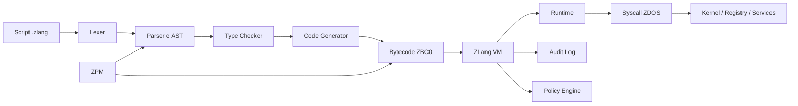

# ZLang: il linguaggio che vuole rendere governabile il potere di un sistema operativo

## Perché il prossimo salto dell’infrastruttura non sarà soltanto un nuovo framework, ma un nuovo execution layer

L’infrastruttura moderna è diventata straordinariamente potente e, allo stesso tempo, difficile da governare.

Un singolo ambiente può includere kernel, container, demoni, API, agenti, job schedulati, webhook, script shell, servizi cloud, nodi edge e sistemi distribuiti. Ogni componente funziona secondo regole proprie. Ogni integrazione aggiunge una nuova superficie di errore. Ogni capacità privilegiata — leggere un file, avviare un processo, aprire una connessione, modificare una configurazione — rischia di diventare un effetto collaterale nascosto dentro una catena operativa troppo lunga per essere compresa interamente.

È in questo spazio che nasce **ZLang**: un linguaggio e un runtime progettati per l’ecosistema ZDOS, con l’ambizione di trasformare l’automazione di sistema in un’attività più strutturata, portabile e governabile.

La sua tesi è radicale ma concreta:

> **Un sistema operativo sovrano ha bisogno di un linguaggio sovrano.**

Non significa costruire un altro linguaggio general-purpose e chiedere agli sviluppatori di ricominciare da zero. Significa creare un execution layer più vicino al sistema operativo di un framework applicativo, ma più controllabile e componibile di una collezione di script.

## Il problema non è più eseguire codice

Eseguire codice è diventato semplice. Il problema è sapere **che cosa quel codice può fare, perché lo può fare, chi glielo ha permesso e come ricostruire ciò che è accaduto**.

Una shell può orchestrare quasi tutto, ma spesso lo fa attraverso stringhe, convenzioni implicite e dipendenze ambientali. Un linguaggio general-purpose può modellare sistemi complessi, ma normalmente richiede un livello ulteriore di integrazione con il sistema operativo. Un orchestratore può coordinare servizi, ma introduce a sua volta API, configurazioni e policy distribuite.

ZLang prova a occupare il confine tra questi mondi. L’obiettivo non è nascondere il sistema operativo, ma renderne le capacità esplicite.

| Esigenza | Direzione proposta da ZLang |
|---|---|
| Automazione riproducibile | Programmi strutturati invece di stringhe operative isolate |
| Portabilità | Bytecode e macchina virtuale |
| Sicurezza | Syscall e capability esplicite |
| Operatività | Runtime per demoni, agenti e servizi persistenti |
| Distribuzione | Package manager, manifest e artefatti versionati |
| Diagnostica | Log, eventi, errori e audit osservabili |

## ZLang non è una promessa di semplicità assoluta

La parte più interessante del progetto non è la promessa di rendere tutto facile. È la scelta di rendere espliciti i compromessi.

Il repository di ZLang documenta un linguaggio con variabili, funzioni, moduli, import, controllo di flusso, gestione degli errori, strutture dati e accesso a primitive di sistema. L’architettura comprende un compilatore, una macchina virtuale, un runtime, syscall ZDOS e un package manager chiamato ZPM. [1] [2] [3]

Ma il progetto dichiara anche, implicitamente, una distinzione che molti progetti evitano di mostrare: la specifica è più ampia del percorso esecutivo prototipale attualmente collegato al binario principale.

Questa trasparenza è importante. Un progetto infrastrutturale non diventa credibile fingendo di essere già completo. Diventa credibile quando separa chiaramente:

- ciò che è specificato;
- ciò che è implementato;
- ciò che è dimostrato;
- ciò che è ancora roadmap.

ZLang è oggi meglio descritto come un **prototipo avanzato con una specifica estesa**. Il suo valore non sta soltanto nel codice che esegue oggi, ma nell’architettura verso cui sta costruendo un percorso verificabile.

## Un’architettura a strati

Il modello di ZLang può essere letto come una catena di responsabilità.

Ogni passaggio risolve un problema diverso.

Il **lexer** trasforma il testo in token. Il **parser** costruisce una rappresentazione sintattica. L’AST rende il programma analizzabile. Il controllo dei tipi riduce ambiguità e comportamenti accidentali. Il code generator produce bytecode. La VM esegue un artefatto portabile. Il runtime offre astrazioni di livello più alto. Le syscall definiscono il confine con ZDOS.

La conseguenza è significativa: un programma non è più soltanto un file eseguibile. È un artefatto che può possedere una versione, un’identità, dipendenze, capability richieste, limiti operativi e un percorso di audit.

## Il bytecode come contratto

La documentazione di ZLang descrive un formato bytecode con header versionato, costanti, simboli e istruzioni composte da opcode e operandi. [3]

Questa scelta non è un dettaglio implementativo. È una decisione architetturale.

Il bytecode può diventare il contratto tra il linguaggio e il runtime. Il compilatore può evolvere senza costringere ogni dispositivo a ricostruire il sorgente. Un artefatto può essere verificato, firmato, archiviato, distribuito e rifiutato se non compatibile con la versione del runtime o con la policy dell’ambiente.

Perché questo modello sia realmente utile, però, servono alcune garanzie:

| Requisito | Perché è necessario |
|---|---|
| Header versionato | Permette di distinguere formati compatibili e incompatibili |
| Opcode stabili | Riduce le ambiguità tra compilatore e VM |
| Codici d’errore | Rende diagnosticabili i fallimenti runtime |
| Limiti di risorse | Impedisce che un programma monopolizzi l’ambiente |
| Identità dell’artefatto | Consente audit, firma e riproducibilità |
| Test cross-platform | Verifica il comportamento su architetture diverse |

La VM non deve essere soltanto veloce. Deve essere prevedibile.

## La sicurezza come confine delle capacità

Il principio di sicurezza più forte di ZLang è che una capacità di sistema non dovrebbe essere implicita.

Un programma che deve scrivere in una directory dovrebbe dichiararlo. Un daemon che deve aprire una connessione dovrebbe avere un perimetro di rete definito. Un agente che deve avviare un processo dovrebbe essere limitato ai comandi autorizzati. Un servizio che deve leggere il registry dovrebbe specificare quali chiavi può consultare.

Questo porta a un modello capability-oriented:

> **Non chiedere soltanto se il codice è corretto. Chiedere quali poteri gli sono stati consegnati.**

La documentazione di ZLang prevede syscall per logging, esecuzione di processi, registry, eventi, tempo e networking. [4] In un’implementazione matura, ogni syscall dovrebbe avere un identificatore stabile, uno schema degli argomenti, un risultato tipizzato, codici d’errore, requisiti di permesso e comportamento definito in caso di timeout.

La sicurezza, in questa prospettiva, non è una libreria aggiunta a valle. È il modo in cui il runtime decide se un’azione può accadere.

## Demoni, edge e infrastrutture distribuite

Il caso d’uso più naturale per ZLang non è il programma desktop. È il software operativo.

Un daemon ZDOS può leggere una configurazione, inizializzare una rete, produrre log, mantenere un ciclo di lavoro, reagire a eventi e terminare in modo controllato. Un agente edge può eseguire lo stesso bytecode su architetture diverse, con profili di syscall differenti. Un nodo distribuito può usare il runtime per coordinare configurazione, networking, telemetria e interazioni con servizi esterni.

Questi scenari hanno una caratteristica comune: non richiedono soltanto logica applicativa. Richiedono **relazione con l’ambiente**.

Ed è proprio questa relazione che ZLang vuole rendere esplicita, testabile e governabile.

## Il riferimento orbitale: SpaceX e Starlink senza scorciatoie narrative

Il repository e la documentazione utilizzano riferimenti a networking, sistemi distribuiti e scenari orbitali. È naturale che, parlando di infrastrutture resilienti e connettività globale, emergano nomi come SpaceX e Starlink.

SpaceX descrive pubblicamente la propria attività nello sviluppo e nel lancio di razzi e veicoli spaziali. [5] Starlink presenta la propria tecnologia come una costellazione satellitare in orbita bassa destinata a fornire connettività a banda larga. [6]

Per ZLang, questi sistemi sono interessanti come **contesto architetturale**: rappresentano ambienti distribuiti, eterogenei, con vincoli di connettività, latenza, disponibilità, telemetria e gestione remota.

È però essenziale essere precisi. ZLang non è un prodotto SpaceX, non è un componente Starlink e non dichiara partnership o endorsement da parte di queste organizzazioni. Il riferimento è concettuale e informativo, non commerciale.

La domanda utile non è “ZLang è usato nello spazio?”. La domanda utile è: **quale tipo di execution layer servirebbe per governare software che deve funzionare in ambienti distribuiti, remoti e difficili da raggiungere?**

## ZPM e l’identità del software

ZPM, il package manager previsto dal progetto, può diventare molto più di uno strumento per installare dipendenze.

Un manifest ZLang dovrebbe descrivere non soltanto il nome e la versione di un pacchetto, ma anche l’entry point, le dipendenze, le capability richieste, la compatibilità del runtime, l’hash dell’artefatto e la firma del maintainer.

In questo modello, distribuire un programma significa distribuire una combinazione verificata di:

- codice;
- bytecode;
- dipendenze;
- policy;
- identità;
- compatibilità;
- autorizzazioni.

Il package manager diventa così un registro dell’identità operativa del software.

## Il punto difficile: trasformare la visione in una piattaforma

La parte più impegnativa non sarà scrivere altri esempi. Sarà rendere coerenti e verificabili i confini tra i componenti.

Il progetto deve unificare il percorso del compilatore, stabilizzare il bytecode, rendere la VM indipendentemente testabile, definire l’ABI delle syscall e introdurre una CI che esegua build, lint, test ed esempi su più architetture.

La roadmap naturale è composta da sei passaggi.

| Fase | Obiettivo |
|---|---|
| Fondazione verificabile | Unificare sorgenti, build e test |
| MVP linguistico | Consolidare sintassi, funzioni, moduli ed error handling |
| Bytecode stabile | Definire formato, opcode, serializzazione e compatibilità |
| Capability security | Applicare policy a filesystem, rete, processi e registry |
| Ecosistema | Rendere ZPM, librerie e artefatti riproducibili |
| Distribuzione sovrana | Portare il runtime su edge e architetture eterogenee |

Il criterio di successo non dovrebbe essere il numero di funzionalità dichiarate. Dovrebbe essere la percentuale di funzionalità documentate che possono essere compilate, eseguite, testate e osservate.

## Una piattaforma non nasce da una slogan

Ogni progetto infrastrutturale corre un rischio: usare parole come “sovrano”, “distribuito”, “zero trust” o “edge” come decorazione narrativa invece che come vincolo ingegneristico.

ZLang può evitare questo rischio soltanto mantenendo una disciplina precisa:

- non promettere una VM completa quando il percorso attivo è ancora prototipale;
- non chiamare “sicura” una syscall senza policy e audit;
- non chiamare “portabile” un runtime senza test su architetture diverse;
- non chiamare “ecosistema” un package manager senza dipendenze riproducibili;
- non chiamare “distribuito” un sistema senza gestione di identità, timeout e fallimenti.

La credibilità tecnica non si costruisce nascondendo i limiti. Si costruisce rendendoli misurabili.

## Il futuro dell’automazione potrebbe essere più esplicito

La maggior parte degli ambienti operativi è stata costruita per aggiunte successive. Un comando qui, un demone là, un webhook per collegare due servizi, una policy in un file separato, un log in un’altra directory.

ZLang propone un’altra direzione: trattare l’automazione come un programma con una semantica, un runtime e un’identità.

Questo non elimina la complessità. La mette in una forma che può essere analizzata.

Un linguaggio operativo maturo potrebbe permettere di rispondere a domande che oggi richiedono spesso indagini manuali:

- quali risorse può usare questo servizio?
- quali syscall ha invocato?
- quale versione del bytecode era attiva?
- quale policy ha autorizzato l’azione?
- quali dipendenze erano presenti?
- l’esecuzione è riproducibile su un altro nodo?

Queste non sono domande accessorie. Sono il fondamento dell’affidabilità infrastrutturale.

## Conclusione

ZLang è ancora in costruzione, ma la sua direzione è già leggibile.

È la direzione di un linguaggio che non vuole soltanto eseguire istruzioni. Vuole definire un rapporto più chiaro tra intenzione, capacità e ambiente.

Il progetto parte da ZDOS, ma la domanda che pone è più ampia: **possiamo costruire software operativo che sia contemporaneamente vicino al sistema, portabile tra ambienti e governabile nei suoi poteri?**

La risposta dipenderà dall’implementazione dei prossimi strati: una VM realmente stabile, un bytecode versionato, syscall con ABI coerente, capability verificabili, package riproducibili e test che trasformino la visione in comportamento.

La promessa più forte di ZLang non è quella di semplificare ogni cosa.

È quella di rendere finalmente esplicito ciò che un programma operativo può fare.

> **Il futuro dei sistemi sovrani non dipenderà soltanto da quanto codice possiamo eseguire, ma da quanto chiaramente possiamo governarne il potere.**

## Risorse

- [Repository GitHub di ZLang](https://github.com/high-cde/Zlang)
- [Whitepaper tecnica di ZLang](https://github.com/high-cde/Zlang/blob/main/ZLANG-WHITEPAPER.md)
- [Specifiche del linguaggio](https://github.com/high-cde/Zlang/blob/main/docs/language-spec.md)
- [Specifiche del bytecode](https://github.com/high-cde/Zlang/blob/main/docs/bytecode-spec.md)
- [Documentazione syscall](https://github.com/high-cde/Zlang/blob/main/docs/syscalls.md)
- [SpaceX — sito ufficiale](https://www.spacex.com/)
- [Starlink — tecnologia](https://www.starlink.com/technology)

## Riferimenti

[1]: https://github.com/high-cde/Zlang/blob/main/README.md "ZLang README"
[2]: https://github.com/high-cde/Zlang/blob/main/docs/language-spec.md "ZLang language specification"
[3]: https://github.com/high-cde/Zlang/blob/main/docs/bytecode-spec.md "ZLang bytecode specification"
[4]: https://github.com/high-cde/Zlang/blob/main/docs/syscalls.md "ZLang syscall documentation"
[5]: https://www.spacex.com/ "SpaceX official website"
[6]: https://www.starlink.com/technology "Starlink official technology page"
