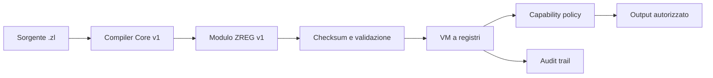

# ZLang

### Deterministic Register-VM Core for ZDOS

**ZLang è un core di esecuzione Rust per ZDOS: sorgente `.zl`, compilatore, bytecode `ZREG`, macchina virtuale a registri, capability esplicite e audit deterministico.**

[](https://github.com/high-cde/Zlang)
[](https://www.rust-lang.org/)
[](https://github.com/high-cde/Zlang)
[](https://github.com/high-cde/Zlang/releases/tag/v2026.2.0)
[](https://raw.githubusercontent.com/high-cde/Zlang/main/ZLANG-WHITEPAPER.md)

> **Il core v1 non esegue codice nativo, shell, rete o syscall host. Ogni programma passa attraverso bytecode verificato, registri limitati, policy di capability e audit runtime.**

## Cosa funziona oggi

| Livello | Implementazione corrente |
|---|---|
| Linguaggio | Interi `i64`, `let`, `print`, `+ - * /`, negazione, parentesi e commenti |
| Compilatore | Lexer/parser integrato con errori strutturati e budget di 16 registri |
| Bytecode | Formato binario `ZREG` v1 con magic, versione, capability, codice e SHA-256 |
| VM | Macchina deterministica con 16 registri, aritmetica controllata e limiti di esecuzione |
| Capability | `ConsoleWrite` dichiarata dal modulo e autorizzata dalla policy runtime |
| Audit | Evento per istruzione: successo, diniego o fallimento |
| CLI | `run`, `compile`, `exec` e `inspect` |
| Qualità | Test end-to-end, formattazione, check e Clippy in CI |

Il core è progettato come fondazione verificabile. Funzioni, moduli, stringhe, collection, rete, filesystem, processi, registry, Z-Chain e ZPM **non sono implementati nel runtime v1** e restano soggetti a proposte, capability, limiti, test e versionamento espliciti.

## Filiera di esecuzione



La VM non è un hypervisor e non sostituisce le protezioni del kernel, dei container o della VPS. Il suo ruolo è definire un confine applicativo riproducibile: nessun accesso host è presente nel core v1 e le istruzioni supportate sono validate prima dell’esecuzione.

## Quick start

```bash
git clone https://github.com/high-cde/Zlang.git
cd Zlang
cargo build --release

cat > /tmp/telemetry.zl <<'EOF'
# Programma Core v1 eseguibile.
let altitude = 408
let correction = altitude / 6
let result = correction + 4
print result
EOF

# Sorgente -> bytecode ZREG.
./target/release/zlang compile /tmp/telemetry.zl /tmp/telemetry.zreg

# Validazione bytecode, esecuzione e audit.
./target/release/zlang exec /tmp/telemetry.zreg --audit
```

L’output è `72`, seguito dagli eventi di audit. Per eseguire senza creare un file modulo intermedio:

```bash
./target/release/zlang run /tmp/telemetry.zl --audit
```

## CLI

| Comando | Funzione |
|---|---|
| `zlang run <source.zl> [--audit]` | Compila in memoria ed esegue il sorgente |
| `zlang compile <source.zl> <module.zreg>` | Produce un modulo bytecode ZREG con checksum |
| `zlang exec <module.zreg> [--audit]` | Verifica e avvia un modulo ZREG |
| `zlang inspect <module.zreg>` | Mostra versione, registri, capability e numero istruzioni |

I codici di uscita sono definiti: `64` uso CLI non valido, `65` sorgente/compilazione, `66` I/O, `70` bytecode o runtime.

## Sicurezza e determinismo

| Controllo | Comportamento v1 |
|---|---|
| Validazione modulo | Magic `ZREG`, versione, checksum, capability, registri e `HALT` terminale |
| File di registri | Massimo 16 registri `i64`; nessun puntatore o memoria host esposta |
| Aritmetica | Overflow e divisione per zero sono errori controllati |
| Budget runtime | Limite default di 100.000 istruzioni e 64 KiB output |
| Capability | `EMIT` richiede `ConsoleWrite` nel modulo e nella policy |
| Audit | Ogni istruzione registra `Allowed`, `Denied` o `Failed` |
| Accesso host | Filesystem, processi e rete non esistono nel core v1 |

## Stato e roadmap

ZLang è un **prototipo avanzato con core runtime concreto**. Il contratto di `ZREG` v1 è implementato e testato; la prima release stabile richiede il completamento della [checklist di rilascio](https://raw.githubusercontent.com/high-cde/Zlang/main/docs/STABLE-RELEASE-CHECKLIST.md), inclusi coverage, packaging verificabile, licenza, release candidate e hardening multi-piattaforma.

Le prossime estensioni devono essere promosse nell’ordine seguente: controllo di flusso e funzioni; tipi e memoria guest; ABI syscall capability-based; sandbox OS/container; networking e filesystem; package management e distribuzione firmata. Nessuna estensione verrà considerata disponibile senza semantica, bytecode, policy, test e documentazione allineati.

## Repository

```text
Zlang/
├── src/
│   ├── compiler/          # Front-end Core v1 -> istruzioni a registri
│   ├── vm/                # ZREG, validazione, policy, VM e audit
│   ├── error.rs           # Errori strutturati e codici CLI
│   └── main.rs            # CLI run/compile/exec/inspect
├── tests/                 # Test bytecode, VM, capability e CLI
├── docs/                  # Specifiche, checklist e wiki
├── .github/workflows/     # CI Rust
├── ZLANG-WHITEPAPER.md    # Visione strategica e roadmap
└── one-shot-zlang.sh      # Validazione locale con backup
```

## Documentazione

- [Indice tecnico](https://raw.githubusercontent.com/high-cde/Zlang/main/docs/README.md)
- [Core language v1](https://raw.githubusercontent.com/high-cde/Zlang/main/docs/language-spec.md)
- [Bytecode ZREG v1](https://raw.githubusercontent.com/high-cde/Zlang/main/docs/bytecode-spec.md)
- [Checklist prima release stabile](https://raw.githubusercontent.com/high-cde/Zlang/main/docs/STABLE-RELEASE-CHECKLIST.md)
- [Security policy](https://raw.githubusercontent.com/high-cde/Zlang/main/SECURITY.md)
- [Whitepaper](https://raw.githubusercontent.com/high-cde/Zlang/main/ZLANG-WHITEPAPER.md)

## Contribuire

Ogni contributo al core deve includere semantica, errore previsto, impatto sulle capability, limiti di risorsa, test di regressione e aggiornamento della documentazione. Per nuove capacità host, il progetto richiede inoltre una review di sicurezza prima dell’abilitazione.

## Marchi e riferimenti esterni

SpaceX e Starlink, ove menzionati nella whitepaper come esempi contestuali di sistemi distribuiti o orbitali, non sono partner, utenti, sponsor né affiliati di ZLang o ZDOS.
