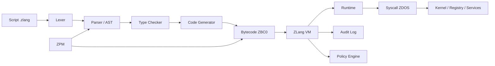

<div align="center">

# ZLang

### The Sovereign Execution Layer for ZDOS

**Un linguaggio nativo per sistemi operativi, automazione governata e infrastrutture distribuite.**

[](https://github.com/high-cde/Zlang)
[](https://www.rust-lang.org/)
[](https://github.com/high-cde/Zlang)
[](https://github.com/high-cde/Zlang/commits/main/)
[](https://github.com/high-cde/Zlang/stargazers)
[](https://github.com/high-cde/Zlang/issues)
[](./ZLANG-WHITEPAPER.md)

</div>

> **ZLang non è soltanto un linguaggio. È un confine governato tra intenzione operativa e potere di sistema.**

## Visione

I sistemi operativi moderni sono composti da shell, demoni, API, agenti, runtime e orchestratori. ZLang nasce per riunire questi livelli in un execution layer compatto, portabile e verificabile per l’ecosistema **ZDOS**.

La sua tesi è semplice: **un sistema operativo sovrano ha bisogno di un linguaggio sovrano**. Un linguaggio capace di descrivere servizi, automazioni e operazioni privilegiate senza rinunciare a controllo, audit, policy e riproducibilità.

ZLang è progettato per scripting di sistema, demoni, orchestrazione di tool, runtime edge, networking e client o nodi blockchain. La visione tecnica comprende compilatore, bytecode, macchina virtuale, runtime, syscall ZDOS e package manager ZPM.

## Perché ZLang

| Problema | Risposta ZLang |
|---|---|
| Script difficili da governare | Programmi strutturati, tipizzabili e sottoponibili a policy |
| Runtime eterogenei | Bytecode e VM come contratto di portabilità |
| Capacità di sistema implicite | Syscall esplicite, capability e confini di autorizzazione |
| Demoni distribuiti senza uniformità | Runtime comune per servizi, agenti e automazioni |
| Dipendenze non verificabili | ZPM, manifest, versionamento e artefatti firmabili |
| Integrazioni remote rischiose | Whitelist, ruoli, audit e divieto di codice arbitrario |

## Architettura



### Componenti principali

| Componente | Funzione |
|---|---|
| `compiler/` | Lexer, parser, AST, type checking e code generation |
| `vm/` | Bytecode, valori runtime, VM e syscall |
| `runtime/` | Librerie standard per sistema, rete e filesystem |
| `src/` | Entry point Rust e percorso runtime attivo |
| `zpm/` | Package manager e modello di progetto |
| `examples/` | Esempi di script, daemon e nodo chain |
| `docs/` | Specifiche del linguaggio, bytecode e syscall |

## Linguaggio

La specifica di ZLang prevede una sintassi compatta con variabili, funzioni, moduli, import, controllo di flusso, gestione degli errori e strutture dati.

```zlang
module chain.node

import sys
import net

func main() {
    sys.log("chain.node", "boot")

    let cfg = sys.registry.get("chain.node")
    sys.log("chain.node", "node online")

    while true {
        tick(cfg)
        sys.sleep(1000)
    }
}
```

I tipi documentati includono `int`, `float`, `bool`, `str`, `bytes`, `list`, `map` e `func`. Gli operatori previsti coprono aritmetica, confronti, logica, chiamate e accesso a strutture dati. [1]

## Esecuzione

Il flusso concettuale è:

```text
.zlang source
     ↓
lexer → parser → AST → type checker
     ↓
bytecode ZBC0
     ↓
ZLang VM
     ↓
runtime + syscall ZDOS
```

La documentazione prevede una CLI con comandi per eseguire script, compilare bytecode ed eseguire artefatti compilati:

```bash
# Build del progetto Rust
cargo build --release

# Esecuzione dello script, secondo la CLI prevista
zlang run examples/hello.zlang

# Compilazione in bytecode, secondo la CLI prevista
zlang build examples/hello.zlang -o build/hello.zbc

# Esecuzione del bytecode, secondo la CLI prevista
zlang exec build/hello.zbc
```

> **Nota sullo stato:** il repository è in sviluppo attivo. La specifica descrive una superficie linguistica più ampia del percorso esecutivo prototipale attualmente collegato al binario principale. Per una valutazione precisa, consultare la [whitepaper tecnica](./ZLANG-WHITEPAPER.md) e la documentazione in `docs/`.

## Sicurezza come architettura

ZLang tratta le capacità di sistema come privilegi espliciti, non come effetti collaterali invisibili.

| Superficie | Controllo previsto |
|---|---|
| Filesystem | Scope di lettura/scrittura e directory autorizzate |
| Networking | Endpoint, protocolli e timeout dichiarati |
| Processi | Comandi consentiti e limiti di esecuzione |
| Registry | Chiavi e operazioni autorizzate |
| Risorse | Memoria, tempo, file descriptor e retry |
| Esecuzione remota | Script registrati, whitelist e ruoli |
| Audit | Identità dello script, versione, syscall ed esito |

Per le integrazioni remote, il progetto adotta un principio essenziale: **mai eseguire codice arbitrario ricevuto direttamente da un canale esterno**. Un bot, un webhook o un daemon devono riferirsi a script registrati, versionati e autorizzati.

## ZPM: il package manager come registro d’identità

ZPM è progettato per gestire manifest, dipendenze e build di progetti ZLang.

```toml
[package]
name = "chain-node"
version = "0.1.0"
entry = "src/main.zlang"

[deps]
net = "core"
sys = "core"
```

In una release matura, ZPM dovrebbe estendere questo modello con capability richieste, compatibilità del runtime, hash degli artefatti, firme dei maintainer e build riproducibili.

## Casi d’uso

### Demoni ZDOS

Servizi persistenti capaci di leggere configurazioni, emettere log, interagire con il registry e mantenere cicli operativi controllati.

### Orchestrazione di sistema

Workflow riproducibili per verificare prerequisiti, avviare processi, gestire errori, applicare retry e produrre audit log.

### Edge e dispositivi eterogenei

Un runtime compatto e un bytecode versionato possono offrire una superficie comune tra Linux, Termux, ARM e sistemi x86 legacy, nei limiti delle syscall disponibili.

### Infrastrutture distribuite

Client, agenti e nodi che coordinano networking, configurazione, eventi, telemetria e interazioni con servizi distribuiti.

## SpaceX, Starlink e il contesto orbitale

ZLang include riferimenti concettuali a networking, nodi distribuiti e scenari orbitali. Questi riferimenti appartengono alla **visione applicativa e all’ispirazione tecnica** del progetto; non costituiscono una partnership, integrazione ufficiale o affiliazione con SpaceX o Starlink.

Per contesto esterno:

- [SpaceX](https://www.spacex.com/) descrive pubblicamente la propria attività nello sviluppo e lancio di razzi e veicoli spaziali.
- [Starlink Technology](https://www.starlink.com/technology) presenta la propria rete come una costellazione satellitare in orbita bassa orientata alla connettività a banda larga.
- Gli [aggiornamenti ufficiali di SpaceX](https://www.spacex.com/updates) forniscono il contesto pubblico sulle attività di lancio e sulle missioni dell’azienda.

ZLang può essere discusso in relazione a questi scenari come **execution layer concettuale per sistemi distribuiti, edge e connettività resiliente**. Non deve essere presentato come tecnologia SpaceX/Starlink né come prodotto approvato, sponsorizzato o utilizzato da tali organizzazioni.

## Stato del progetto

| Area | Stato |
|---|---|
| Visione e posizionamento | Definiti |
| Specifica linguistica | Documentata e in evoluzione |
| Struttura compilatore/VM | Presente nel repository |
| Percorso esecutivo attivo | Prototipale |
| Bytecode binario completo | In consolidamento |
| Syscall ZDOS | Specifica concettuale da stabilizzare come ABI |
| ZPM | Direzione progettuale iniziale |
| CI e test cross-platform | Da consolidare |

ZLang è attualmente un **prototipo avanzato con specifica estesa**. La roadmap pubblica privilegia la trasparenza: ogni funzionalità deve passare dalla visione documentale a un’implementazione testata, osservabile e riproducibile.

## Roadmap

### Phase I — Verified Foundation

Unificare il percorso sorgente, rendere riproducibile la build e aggiungere test automatici per lexer, parser, compilatore, VM ed esempi.

### Phase II — Language MVP

Consolidare numeri, stringhe, variabili, funzioni, condizioni, cicli, moduli ed error handling.

### Phase III — Stable Bytecode

Stabilizzare header, opcode, serializzazione, versionamento, compatibilità e limiti di risorsa.

### Phase IV — Capability Security

Collegare syscall e policy a capability verificabili, con audit, timeout e controlli per filesystem, rete, processi e registry.

### Phase V — Ecosystem

Rendere ZPM riproducibile, introdurre pacchetti firmati, librerie standard e aggiornamenti verificati.

### Phase VI — Sovereign Distribution

Portare il runtime su architetture eterogenee e scenari edge/distribuiti con profili di compatibilità documentati.

## Repository map

```text
Zlang/
├── compiler/             # Lexer, parser, AST, typecheck e codegen
├── vm/                   # VM, bytecode, valori e syscall
├── runtime/              # Librerie standard ZLang
├── src/                  # Entry point e runtime attivo
├── zpm/                  # Package manager
├── examples/             # Script dimostrativi
├── docs/                 # Specifiche tecniche
├── ZLANG-WHITEPAPER.md   # Whitepaper strategica e tecnica
└── one-shot-zlang.sh     # Validazione locale con backup, senza push automatico
```

## Quick start

```bash
git clone https://github.com/high-cde/Zlang.git
cd Zlang

# Procedura locale sicura: backup, controlli e report.
./one-shot-zlang.sh

# Build quando Rust/Cargo è disponibile.
cargo build --release
```

La procedura `one-shot-zlang.sh` non cancella `src/`, non esegue push remoto automatico e crea un backup datato prima dei controlli.

## Contribuire

Il contributo più utile è trasformare la specifica in comportamento verificabile. Prima di proporre una modifica, descrivere il caso d’uso, il comportamento previsto, gli errori possibili, le implicazioni di sicurezza e il test associato.

Le contribuzioni dovrebbero mantenere separati il core della VM, il runtime, le syscall ZDOS e gli strumenti dell’ecosistema. Ogni nuova syscall dovrebbe avere una specifica, un identificatore stabile, un contratto degli argomenti, codici d’errore e almeno un test.

## Licenza e marchi

Verificare il file di licenza del repository prima di redistribuire il codice. **SpaceX**, **Starlink** e i relativi nomi e marchi appartengono ai rispettivi titolari. I riferimenti in questo README hanno esclusivamente funzione contestuale e informativa; non implicano endorsement, partnership o affiliazione.

## Documentazione e riferimenti

- [Whitepaper ZLang](./ZLANG-WHITEPAPER.md)
- [Specifiche del linguaggio](./docs/language-spec.md)
- [Specifiche del bytecode](./docs/bytecode-spec.md)
- [Syscall ZDOS](./docs/syscalls.md)
- [Script one-shot sicuro](./one-shot-zlang.sh)
- [SpaceX — sito ufficiale](https://www.spacex.com/)
- [Starlink — tecnologia](https://www.starlink.com/technology)
- [SpaceX — aggiornamenti](https://www.spacex.com/updates)

## Riferimenti

[1]: ./docs/language-spec.md "ZLang language specification"
[2]: ./docs/bytecode-spec.md "ZLang bytecode specification"
[3]: ./docs/syscalls.md "ZLang syscall documentation"
[4]: ./ZLANG-WHITEPAPER.md "ZLang technical whitepaper"
