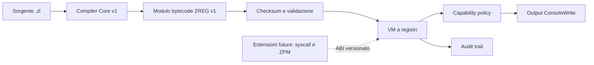

# ZLang
## The Sovereign Execution Layer for ZDOS

### Whitepaper tecnica e strategica — Edizione 2026

**Versione:** 1.0  
**Stato del documento:** Visione tecnica, architettura proposta e valutazione dello stato del repository  
**Autore editoriale:** Manus AI  
**Repository di riferimento:** [high-cde/Zlang](https://github.com/high-cde/Zlang)

---

## Abstract

I sistemi operativi moderni sono costruiti su strati tecnologici potenti ma frammentati: shell, demoni, API, agenti, runtime, orchestratori e servizi remoti. Ogni strato possiede convenzioni, modelli di sicurezza e linguaggi differenti. ZLang nasce per ridurre questa frammentazione nell’ecosistema ZDOS, offrendo un linguaggio nativo per descrivere operazioni di sistema, automazione, servizi persistenti e interazioni con infrastrutture distribuite.

La tesi di questa whitepaper è semplice: **un sistema operativo sovrano ha bisogno di un linguaggio sovrano**. Non un linguaggio general-purpose che replica ciò che già esiste, ma un execution layer compatto, portabile e governabile, capace di tradurre intenzioni operative in azioni verificabili.

ZLang propone un modello basato su compilatore, bytecode, macchina virtuale, runtime, syscall e package manager. La documentazione del progetto descrive supporto per tipi primitivi e strutture dati, funzioni, moduli, controllo di flusso, gestione degli errori, accesso al sistema operativo, networking e integrazioni con Z-Chain. [1] [2] [3]

Il repository analizzato contiene già il nucleo concettuale di questa visione e un percorso dimostrativo di esecuzione. Allo stesso tempo, alcune componenti sono ancora prototipali o non completamente collegate tra loro. Questa whitepaper separa deliberatamente la **visione di protocollo** dallo **stato effettivo dell’implementazione**, perché la credibilità di una piattaforma nasce dalla capacità di dichiarare con precisione ciò che è disponibile, ciò che è in sviluppo e ciò che è ancora progettuale.

## 1. La tesi: dal sistema operativo al sistema eseguibile

Un sistema operativo non è soltanto un kernel. È una grammatica di poteri: leggere e scrivere dati, avviare processi, comunicare, osservare, registrare eventi, applicare policy e mantenere stato. Tradizionalmente queste capacità vengono esposte attraverso interfacce diverse, spesso difficili da comporre e da sottoporre a controllo uniforme.

ZLang propone di introdurre un livello semantico comune. Uno script non dovrebbe essere considerato soltanto testo da interpretare; dovrebbe diventare un artefatto eseguibile con identità, limiti, dipendenze, permessi e comportamento osservabile.

> **Principio fondativo:** ogni azione di sistema deve essere esprimibile, verificabile e governabile prima di essere eseguita.

Questo principio porta a quattro obiettivi:

| Obiettivo | Significato |
|---|---|
| Portabilità | Eseguire lo stesso bytecode su architetture diverse, compatibilmente con il runtime |
| Governabilità | Collegare ogni capacità privilegiata a syscall, policy e permessi espliciti |
| Componibilità | Unire script, demoni, librerie e servizi in una toolchain coerente |
| Osservabilità | Rendere eventi, output, errori e transizioni del runtime analizzabili |

## 2. Che cos’è ZLang

ZLang è progettato come linguaggio nativo per ZDOS. Il Core v1 usa l’estensione `.zl`; l’eventuale estensione `.zlang` resta una scelta futura di compatibilità. Il suo campo d’azione progettuale comprende scripting di sistema, demoni, orchestrazione di tool, nodi o client blockchain e automazione di servizi. [1]

La scelta di un linguaggio dedicato non mira a sostituire Rust, C, Python o la shell in ogni scenario. Mira invece a creare una superficie intermedia: più strutturata e governabile di una shell, più leggera di un framework generale, più integrata con ZDOS di un runtime esterno.

La distinzione è strategica. ZLang non deve vincere perché è il linguaggio più ricco in assoluto; deve vincere perché rende più semplice costruire **software operativo affidabile dentro un ecosistema controllato**.

## 3. Architettura di riferimento

L’architettura proposta separa la definizione del programma dall’ambiente che ne governa l’esecuzione.

### 3.1 Front-end linguistico

Il front-end implementato comprende tokenizzazione, parsing e compilazione del Core v1: interi `i64`, binding `let`, `print`, aritmetica, negazione e parentesi. Funzioni, moduli, import, cicli, eccezioni e literal composti restano estensioni progettuali, non feature disponibili. [2]

Questa stratificazione è importante perché consente di controllare un programma prima dell’esecuzione. Un errore di sintassi deve essere individuato dal parser; un errore di tipo dal type checker; un permesso insufficiente dal runtime o dal policy engine. Separare questi livelli riduce la quantità di comportamento implicito.

### 3.2 Bytecode

Il bytecode implementato è `ZREG` v1: header con magic, versione, registri dichiarati, capability, sezione codice e checksum SHA-256. Il runtime rifiuta moduli corrotti, versione incompatibile, registri non validi, capability sconosciute o `HALT` non terminale prima dell’esecuzione. [3]

Un formato versionato permette di archiviare, distribuire e verificare un programma senza dover ridistribuire il sorgente originale. La compatibilità è esplicita: ZREG v1 esegue soltanto moduli della versione `1`.

### 3.3 Macchina virtuale

La VM implementata è una macchina deterministica a registri con file fisso di 16 registri `i64`. Le istruzioni v1 includono caricamento immediato, copia, aritmetica controllata, negazione, output autorizzato e arresto. Overflow e divisione per zero interrompono l’esecuzione con errori strutturati, senza panic. [3]

La VM è il punto in cui la portabilità incontra la sicurezza. Il bytecode v1 non ha accesso diretto a memoria host, shell, rete o filesystem. L’unica capability implementata è `ConsoleWrite`, dichiarata dal modulo e verificata dalla policy prima dell’istruzione `EMIT`.

### 3.4 Runtime e syscall

Nel core ZREG v1 non sono presenti syscall host. Logging, processi, registry, eventi, tempo e networking sono riservati a un ABI futuro, capability-based e deny-by-default. [4]

L’interfaccia syscall futura sarà trattata come un ABI pubblico. Ogni syscall richiederà identificatore stabile, schema argomenti, risultato tipizzato, codici d’errore, capability dedicata, limiti di risorsa, audit e comportamento deterministico in caso di timeout o risorsa indisponibile.

## 4. Il modello di sicurezza

La sicurezza di ZLang non può essere affidata soltanto alla correttezza del codice dello script. Deve essere una proprietà dell’intera catena: sorgente, compilatore, bytecode, VM, runtime, syscall, configurazione e infrastruttura di distribuzione.

### 4.1 Confine delle capacità

Uno script dovrebbe ricevere solo le capacità necessarie al proprio scopo. Un logger non dovrebbe poter firmare transazioni; un servizio di rete non dovrebbe poter modificare arbitrariamente il registry; un comando remoto non dovrebbe poter eseguire codice non autorizzato.

### 4.2 Policy dichiarative

La configurazione di un progetto dovrebbe poter dichiarare:

| Dimensione | Esempio di policy |
|---|---|
| Filesystem | Accesso in lettura a una directory specifica |
| Rete | Connessioni consentite verso endpoint definiti |
| Processi | Comandi autorizzati e limiti di esecuzione |
| Registry | Chiavi accessibili in lettura o scrittura |
| Risorse | Timeout, memoria, numero di file descriptor |
| Identità | Firmatario, proprietario e versione dell’artefatto |

### 4.3 Esecuzione remota

La documentazione relativa all’integrazione Discord propone whitelist di script, divieto di esecuzione arbitraria e mapping tra ruoli e permessi. [1] Questo modello dovrebbe essere generalizzato a ogni superficie remota: API, bot, daemon, webhook e orchestratori.

### 4.4 Audit e riproducibilità

Ogni invocazione privilegiata dovrebbe produrre un evento audit con identificità dello script, versione del bytecode, identità dell’invocatore, syscall richiesta, esito e latenza. La riproducibilità richiede inoltre manifest, versionamento delle dipendenze e build deterministiche.

## 5. Il ruolo di ZPM

ZPM è concepito come package manager e strumento di build per progetti ZLang. Il manifest previsto contiene nome, versione, entry point e dipendenze. [1]

In una piattaforma operativa, ZPM non è soltanto un gestore di pacchetti. È il registro dell’identità del programma. Dovrebbe diventare il punto in cui vengono dichiarati:

1. la versione del progetto;
2. le dipendenze e i loro vincoli;
3. le capacità richieste;
4. la compatibilità del runtime;
5. l’hash dell’artefatto compilato;
6. la firma del maintainer o dell’organizzazione.

In questa prospettiva, installare un pacchetto significa installare una combinazione verificata di codice, metadati, policy e dipendenze.

## 6. Casi d’uso strategici

### 6.1 Demoni nativi ZDOS

ZLang è adatto a demoni di sistema che devono avviarsi al boot, leggere configurazioni dal registry, emettere log e mantenere un ciclo operativo. La sintassi documentata include proprio gli elementi necessari a descrivere questo modello: moduli, import, funzioni, accesso al registry, networking e loop persistenti. [1]

### 6.2 Orchestrazione di tool

Uno script ZLang può fungere da piano operativo riproducibile: verifica prerequisiti, avvia componenti, raccoglie risultati, applica retry, emette eventi e termina con codici d’errore espliciti. Rispetto alla shell, il vantaggio atteso è una semantica più strutturata e controllabile.

### 6.3 Nodi e client distribuiti

Gli esempi del repository includono un nodo chain concettuale. In uno scenario maturo, ZLang potrebbe coordinare bootstrap, configurazione, peer discovery, health check, logica di servizio e interazioni con il layer di firma, senza incorporare necessariamente l’intero consenso nella VM.

### 6.4 Automazione edge e dispositivi legacy

La portabilità dichiarata verso ARM, Termux e vecchi x86 suggerisce un posizionamento edge. Un runtime compatto e un bytecode stabile potrebbero permettere di distribuire lo stesso comportamento su nodi eterogenei, purché le syscall disponibili siano negoziate e versionate.

### 6.5 Automazione governata da eventi

Un sistema ZDOS potrebbe usare eventi di boot, rete, storage, sicurezza o blockchain per attivare script autorizzati. L’evento non dovrebbe contenere codice eseguibile arbitrario; dovrebbe referenziare un programma registrato, una versione e un insieme di parametri validati.

## 7. Stato dell’implementazione

La whitepaper deve distinguere chiaramente la visione dall’attuale repository.

| Componente | Valutazione |
|---|---|
| Visione del linguaggio | Definita e documentata |
| Core sintattico | Implementato e delimitato: interi, `let`, `print`, aritmetica |
| Organizzazione del repository | Percorso canonico sotto `src/` |
| Percorso attivo del binario | Compiler → ZREG v1 → VM a registri |
| Bytecode e VM | Header, checksum, opcode, limiti e audit implementati |
| Capability | `ConsoleWrite` implementata con policy deny-by-default disponibile |
| Syscall host e ZPM | Direzioni progettuali, non implementate |
| Test e CI | Test end-to-end e workflow Rust presenti |

Il percorso principale non interpreta più stringhe dimostrative. Il compilatore produce un modulo binario ZREG verificabile; la VM convalida l’artefatto, applica policy e limiti, quindi produce audit per ciascuna istruzione. Le estensioni oltre il Core v1 restano esplicitamente fuori dal runtime finché non verranno implementate e testate.

Questa differenza non indebolisce la tesi del progetto; definisce piuttosto il lavoro necessario per trasformare un prototipo in una piattaforma. La roadmap deve essere misurata su funzionalità compilabili, testate e osservabili, non soltanto su sezioni documentali.

## 8. Roadmap di evoluzione

### Fase I — Fondazione verificabile

**Stato: realizzata per il Core v1.** Il repository usa un percorso canonico sotto `src/`, la build Rust è riproducibile e la CI esegue formattazione, check, test e Clippy. Il core dispone di test end-to-end per sorgente, bytecode, capability, audit e CLI.

### Fase II — MVP linguistico

**Stato: in corso.** Numeri, binding `let`, aritmetica, error handling e output autorizzato sono implementati. Stringhe, funzioni, condizioni, cicli e moduli saranno aggiunti solo con semantica, bytecode, limiti e test completi.

### Fase III — Bytecode e VM stabili

**Stato: fondazione realizzata.** ZREG v1 dispone di header, checksum SHA-256, opcode a registri, serializzazione, validazione, limiti e test indipendenti dal front-end. Le prossime versioni dovranno introdurre nuove semantiche soltanto attraverso versionamento esplicito.

### Fase IV — Capability security

Le syscall devono essere collegate a capability e policy. L’esecuzione di processi, l’accesso alla rete, il registry e il filesystem devono avere permessi espliciti, audit e timeout.

### Fase V — Ecosistema

ZPM, librerie standard, registry di pacchetti, firma degli artefatti, aggiornamenti verificati e integrazioni con ZDOS possono essere consolidati soltanto dopo la stabilizzazione del core.

### Fase VI — Distribuzione sovrana

L’ultima fase porta ZLang su nodi eterogenei, dispositivi edge e servizi distribuiti. La compatibilità deve essere definita tramite versioni del runtime, profili di syscall e test cross-compilation.

## 9. Metriche di successo

Una whitepaper credibile deve convertire la visione in metriche.

| Area | Metrica proposta |
|---|---|
| Compilazione | Percentuale di esempi documentali compilabili in CI |
| Compatibilità | Numero di architetture supportate con test riproducibili |
| VM | Stabilità del formato bytecode tra release compatibili |
| Sicurezza | Copertura delle syscall con policy e audit |
| Affidabilità | Test di errore, timeout e recupero dei demoni |
| Ecosistema | Pacchetti versionati e firmati disponibili tramite ZPM |
| Operatività | Tempo medio di diagnosi tramite log ed eventi |

## 10. Posizionamento finale

ZLang non deve essere presentato come “un altro linguaggio”. La sua identità è più precisa: **un execution layer governato per sistemi operativi e infrastrutture sovrane**.

La sua opportunità nasce dall’intersezione di cinque esigenze: portabilità, automazione, sicurezza delle capacità, integrazione con il sistema operativo e coordinamento di servizi distribuiti. Se il progetto riuscirà a mantenere il core compatto, la toolchain verificabile e l’ABI delle syscall stabile, potrà diventare una superficie comune per demoni, script e agenti operativi nell’ecosistema ZDOS.

> **ZLang non promette di astrarre il sistema operativo fino a nasconderlo. Promette di renderne le capacità esplicite, componibili e governabili.**

## Conclusione

La visione di ZLang è quella di un linguaggio che tratta l’esecuzione come un atto infrastrutturale: identificato, autorizzato, osservabile e riproducibile. Il repository ora possiede una filiera concreta da cui partire: specifica Core v1, compilatore, bytecode ZREG verificato, VM a registri, policy di capability, audit, CLI e test end-to-end.

Il lavoro decisivo è estendere questa base senza reintrodurre comportamento implicito. Funzioni, memoria guest, ABI syscall, capability host, sandbox OS, networking e ZPM dovranno essere implementati come contratti versionati, testati e documentati. Questo è il passaggio che separa il manifesto da una piattaforma operativa.

La promessa più forte di ZLang non è la quantità di funzionalità. È la possibilità di costruire un linguaggio in cui **il confine tra intenzione operativa e potere di sistema sia finalmente esplicito**.

---

## Riferimenti

[1]: https://raw.githubusercontent.com/high-cde/Zlang/main/README.md "ZLang README e visione del progetto"
[2]: https://raw.githubusercontent.com/high-cde/Zlang/main/docs/language-spec.md "ZLang language specification"
[3]: https://raw.githubusercontent.com/high-cde/Zlang/main/docs/bytecode-spec.md "ZLang bytecode specification"
[4]: https://raw.githubusercontent.com/high-cde/Zlang/main/docs/syscalls.md "ZLang syscall documentation"
[5]: https://raw.githubusercontent.com/high-cde/Zlang/main/Cargo.toml "ZLang Cargo manifest"
