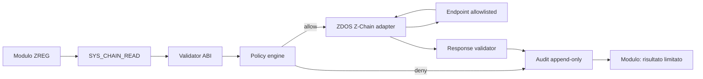

# ZLang — Policy di sicurezza e audit log per `ZChainRead`

**Stato:** proposta di ABI e security policy; non implementata nel runtime ZREG v1.
**Versione proposta policy:** `zchain-read-policy/v1`.
**Classe di capability:** lettura remota non mutante, deny-by-default.

> `ZChainRead` non autorizza una connessione di rete generica. Autorizza esclusivamente query predefinite verso una chain, endpoint, metodo e oggetto consentiti dalla policy firmata del deployer. La VM non sceglie URL arbitrari, non gestisce credenziali segrete e non riceve accesso a chiavi private.

## 1. Obiettivo e confini

`ZChainRead` consente a un modulo ZREG di richiedere dati pubblici o autorizzati da Z-Chain tramite un **host adapter** controllato da ZDOS. Il bytecode presenta una richiesta strutturata; l’host adapter valuta la policy, esegue la query tramite trasporto autenticato e restituisce una risposta limitata. Il modulo non apre socket, non costruisce RPC raw e non legge token, seed phrase o chiavi.

| Dentro il perimetro | Fuori dal perimetro |
|---|---|
| Stato di rete, altezza blocco, dati account/contract allowlisted | Trasferimenti, firma, submit o modifica stato |
| Query RPC allowlisted e versionate | URL, IP, DNS o metodo RPC arbitrari |
| Limiti di quota, timeout, dimensione e concorrenza | Accesso a wallet, HSM, keystore o private key |
| Hash del payload e metadati audit | Logging del payload completo, token o PII non necessari |
| Adapter ZDOS con TLS e pinning configurabile | Trasporto di rete diretto dalla VM guest |

La proposta segue il principio di registrare informazioni sufficienti per ricostruire **quando, dove, chi e cosa** di un evento di sicurezza, senza registrare segreti o dati superflui.[1] [2]

## 2. Modello di fiducia



| Componente | Fiducia | Responsabilità |
|---|---|---|
| Modulo ZREG | Non fidato | Può solo formulare una richiesta ABI valida |
| VM | Fidato ma limitato | Convalida bytecode, capability e struttura richiesta |
| Policy engine | Autoritativo | Applica scope, quote, limiti e decisione allow/deny |
| ZDOS adapter | Privilegiato | Gestisce TLS, endpoint, retry, parsing e redazione dati |
| Endpoint Z-Chain | Esterno/non fidato | Risposta validata, limitata e trattata come input non fidato |
| Audit sink | Privilegiato | Riceve eventi append-only, protetti da alterazione |

Nessun componente esterno deve essere considerato fidato soltanto per reputazione o posizione di rete. Risposte RPC, errori, header, nomi host e payload sono dati non fidati e devono essere validati prima dell’uso.[2]

## 3. Contratto ABI proposto

La richiesta ABI deve essere serializzata in un formato canonico, ad esempio CBOR deterministico o JSON canonico con schema versione `1`. Non viene ammesso un payload RPC libero.

```text
SYS_CHAIN_READ(
  request_id: u128,
  chain_alias: String,
  query_id: String,
  target: TargetSelector,
  parameters: CanonicalValue
) -> ChainReadResult
```

| Campo | Regola di validazione |
|---|---|
| `request_id` | UUID/nonce a 128 bit, unico nella finestra di deduplicazione |
| `chain_alias` | Nome logico presente nella policy, non URL |
| `query_id` | ID di query pubblicato in un catalogo approvato |
| `target` | Account, block reference o contract secondo schema del `query_id` |
| `parameters` | Schema rigido, tipi, range e dimensione definiti dal catalogo |
| Risultato | Oggetto limitato, schema-validato, con risposta massima configurata |

Il catalogo query è parte della superficie di sicurezza. Esempi di query iniziali a basso rischio sono `network.status`, `block.height`, `account.balance.public` e `contract.read_method`, ma ciascuna deve avere schema, versione, limiti e classificazione dati indipendenti.

## 4. Policy deny-by-default

Se manca una regola che corrisponde simultaneamente a **modulo, versione, chain, query, target, endpoint e budget**, la richiesta è negata. Le regole di allow sono additive solo quando tutti i vincoli risultano soddisfatti; una regola di deny esplicito ha precedenza.

### 4.1 Schema policy YAML

```yaml
apiVersion: zchain-read-policy/v1
policyId: zdos.telemetry.readonly
revision: 7
mode: deny-by-default

subjects:
  - moduleId: "sha256:7a15...c0de"
    bytecodeVersion: 1
    runtimeVersion: ">=2026.2.0 <2027.0.0"
    environment: ["production"]

chains:
  zchain-mainnet:
    chainId: "zchain-mainnet-1"
    endpoints:
      - id: "rpc-primary"
        url: "https://rpc-01.example.invalid"
        tls:
          minVersion: "1.3"
          spkiPins: ["sha256/base64-pin-1"]
    allowedQueries:
      - queryId: "network.status@1"
      - queryId: "block.height@1"
      - queryId: "account.balance.public@1"
        targetRules:
          accountAllowlist: ["z1telemetry...", "z1oracle..."]

limits:
  requestsPerMinute: 30
  requestsPerDay: 10000
  maxConcurrentRequests: 2
  timeoutMs: 2500
  connectTimeoutMs: 800
  maxResponseBytes: 65536
  maxRequestBytes: 4096
  maxRedirects: 0
  retry:
    maxAttempts: 1
    retryableErrors: ["timeout", "transport_reset", "http_503"]

responsePolicy:
  requireSchemaValidation: true
  allowRawResponse: false
  allowUnfinalizedData: false
  maxBlockAgeSeconds: 120

audit:
  sink: "zchain-read-security"
  integrity: "hash-chain+daily-signature"
  retentionDays: 400
  includeRequestPayload: "hash-only"
  includeResponsePayload: "hash-only"
  alertOn: ["deny", "quota_exceeded", "endpoint_pin_failure", "schema_failure"]
```

Gli URL nell’esempio sono configurazione dell’host adapter, non valori che il bytecode può fornire. In produzione, i pin devono essere gestiti con procedura di rotazione approvata e la policy deve essere firmata o distribuita tramite canale autenticato.

### 4.2 Ordine di valutazione obbligatorio

| Ordine | Controllo | Esito in caso di fallimento |
|---:|---|---|
| 1 | Versione ABI e forma richiesta | `invalid_request` |
| 2 | Identità del modulo e hash bytecode | `subject_mismatch` |
| 3 | Capability `ZChainRead` dichiarata e autorizzata | `capability_denied` |
| 4 | Ambiente, runtime e policy revision | `environment_denied` |
| 5 | `chain_alias`, chain ID e query ID allowlisted | `scope_denied` |
| 6 | Target e parametri conformi allo schema | `parameter_denied` |
| 7 | Quota, concorrenza e budget | `quota_exceeded` |
| 8 | Endpoint, DNS, TLS e SPKI pin | `transport_denied` |
| 9 | Timeout, dimensione e schema risposta | `response_rejected` |
| 10 | Scrittura audit durabile | `audit_failure` secondo fail mode |

La policy deve utilizzare un identificatore di chain indipendente dall’endpoint. Una modifica di DNS, URL o certificato non deve cambiare il significato della chain autorizzata né consentire un endpoint non previsto.

## 5. Controlli obbligatori per endpoint e trasporto

L’host adapter applica i seguenti requisiti anche se il modulo dichiara `ZChainRead`:

| Controllo | Requisito |
|---|---|
| Protocollo | Solo HTTPS o trasporto autenticato equivalente; nessun HTTP in produzione |
| DNS | Risoluzione dal lato adapter; nessun host controllato dal guest |
| SSRF | Bloccare indirizzi loopback, link-local, RFC1918, metadata endpoint e redirect |
| TLS | Verifica CA, hostname e versione minima TLS; SPKI pin quando configurato |
| Redirect | Disabilitati per default; mai seguire redirect verso origine diversa |
| Metodo | Solo il metodo dichiarato dal catalogo query, tipicamente POST RPC o GET statico controllato |
| Timeout | Connect, request e total timeout separati; nessun timeout infinito |
| Dimensione | Rifiutare request/response oltre i limiti prima della deserializzazione completa |
| Parsing | Deserializzazione con schema e limiti di profondità/elementi |
| Retry | Solo errori transienti, budget limitato, backoff con jitter e nessun retry di errore policy |
| Cache | Chiave cache include `chainId`, `queryId`, target e parametri hash; TTL esplicito |

L’adapter non deve esporre al modulo header, certificati, stack trace, URL completi, DNS interno o dettagli di errore dell’infrastruttura. Il modulo riceve un codice errore stabile e dati limitati dal contratto della query.

## 6. Quote, rate limit e prevenzione replay

`ZChainRead` è un’operazione di lettura, ma può comunque causare costi, indisponibilità, enumerazione dati o abuso dell’infrastruttura. Le quote devono essere applicate su più chiavi:

| Chiave | Perché |
|---|---|
| `module_id + bytecode_hash` | Blocca modulo specifico compromesso o abusivo |
| `policy_id + revision` | Traccia il contesto autorizzativo |
| `chain_id + query_id` | Protegge endpoint e metodo più costosi |
| `target_hash` | Limita enumerazione su account/contract sensibili |
| `environment` | Separa dev, staging e produzione |

`request_id` deve essere conservato per almeno `max(timeout, retry_window) + skew_clock` e una richiesta duplicata deve restituire il risultato precedente, un errore `duplicate_request` o un handle idempotente, mai produrre una nuova chiamata incontrollata. Anche nelle sole letture, questa misura evita replay, duplicazione di costi e audit ambiguo.

## 7. Audit log append-only

L’audit di sicurezza è distinto da log diagnostici e stdout. Ogni tentativo, autorizzato o negato, produce un evento. La struttura usa JSON Lines canonico o CBOR, con campi fissi e una catena hash per partizione.

### 7.1 Schema evento

```json
{
  "schema": "zlang.audit.zchain-read/v1",
  "event_id": "01J...",
  "sequence": 98124,
  "occurred_at": "2026-08-17T22:05:31.441Z",
  "monotonic_ns": 228310045510,
  "correlation_id": "req-4c7d...",
  "trace_id": "trace-8f2c...",

  "subject": {
    "module_id": "sha256:7a15...c0de",
    "bytecode_sha256": "7a15...c0de",
    "bytecode_version": 1,
    "runtime_version": "2026.2.0",
    "capability": "ZChainRead",
    "environment": "production"
  },

  "request": {
    "chain_id": "zchain-mainnet-1",
    "chain_alias": "zchain-mainnet",
    "query_id": "account.balance.public@1",
    "target_hash": "sha256:0b0b...",
    "parameters_hash": "sha256:9c2a...",
    "request_bytes": 218,
    "request_id": "8a1a..."
  },

  "policy": {
    "policy_id": "zdos.telemetry.readonly",
    "policy_revision": 7,
    "decision": "allow",
    "matched_rule_id": "zchain-mainnet/account.balance.public",
    "limits": {
      "requests_remaining_minute": 24,
      "timeout_ms": 2500,
      "max_response_bytes": 65536
    }
  },

  "transport": {
    "endpoint_id": "rpc-primary",
    "protocol": "https",
    "tls_verified": true,
    "spki_pin_id": "pin-1",
    "attempt": 1,
    "latency_ms": 143
  },

  "response": {
    "outcome": "success",
    "result_code": "ok",
    "http_status": 200,
    "response_bytes": 1287,
    "response_schema": "account.balance.public@1",
    "response_hash": "sha256:8f92...",
    "block_reference": "height:123456"
  },

  "integrity": {
    "previous_event_hash": "sha256:...",
    "event_hash": "sha256:...",
    "partition": "2026-08-17/zchain-read/00"
  }
}
```

### 7.2 Campi minimi obbligatori

| Gruppo | Campi obbligatori | Motivazione |
|---|---|---|
| Identità | `event_id`, `sequence`, timestamp UTC, `correlation_id` | Ordinamento, deduplicazione e correlazione |
| Soggetto | hash modulo, versione bytecode/runtime, ambiente | Attribuzione precisa al codice che ha richiesto l’azione |
| Richiesta | chain ID, query ID, target/parametri hash, dimensione | Ricostruzione senza esporre dati completi |
| Policy | ID/revisione, decisione, regola, motivo deny | Dimostrazione del controllo di accesso |
| Trasporto | endpoint ID, TLS, tentativo, latenza | Diagnosi di rischio o indisponibilità senza rivelare segreti |
| Risposta | outcome, codice, dimensione, hash, block reference | Verifica della risposta e dei limiti |
| Integrità | hash precedente, hash evento, partizione | Individuazione di alterazioni o buchi nel flusso |

## 8. Dati da non registrare

Non includere mai direttamente seed phrase, private key, credenziali RPC, token bearer, cookie, header `Authorization`, URL firmati, session ID, payload integrale con PII o dati commercialmente sensibili. Utilizzare hash con prefisso di dominio, redazione, tokenizzazione o cifratura selettiva quando serve correlare dati senza conservarli in chiaro.[2]

Il campo `target_hash` deve usare una funzione con domain separation, ad esempio:

```text
SHA-256("zlang:zchain-read:target:v1" || canonical_target_bytes)
```

Ciò riduce collisioni semantiche tra hash di domini differenti. Per target pubblici e non sensibili può essere registrato un alias approvato; non registrare indiscriminatamente account, contract o parametri completi.

## 9. Integrità, immutabilità e retention

Ogni partizione audit mantiene una hash chain:

```text
event_hash = SHA-256(canonical_event_without_integrity || previous_event_hash)
```

Al termine della finestra di rotazione, ad esempio ogni giorno o ogni 100.000 eventi, il collector produce un checkpoint firmato dal servizio audit. I checkpoint vengono replicati su storage a scrittura protetta, con separazione delle credenziali tra writer, reader e amministratore retention. Una hash chain migliora la rilevazione di manomissioni, ma non crea da sola non-ripudio assoluto: la fiducia dipende anche dalla protezione delle chiavi, del collector e dello storage.[2]

| Livello | Regola proposta |
|---|---|
| Hot storage | 30 giorni, query operativa e alert |
| Warm storage | 370 giorni, cifrato e accesso investigativo controllato |
| Checkpoint | Conservazione minima 7 anni o secondo requisito organizzativo |
| Cancellazione | Job auditato, retention policy versionata e approvata |
| Accesso | RBAC, MFA per lettura sensibile, writer append-only |
| Tempo | UTC, clock sincronizzato, timestamp monotonic locale e indicatore drift |

Il periodo di retention deve essere adattato a normativa, contratto e classificazione dei dati. La policy non deve trasformare l’audit in archivio illimitato di dati personali o payload RPC.

## 10. Fail mode dell’audit

Per `ZChainRead` in produzione, la policy consigliata è **fail closed per perdita dell’audit sink** oltre una piccola coda locale cifrata e limitata. Se l’evento non può essere registrato in modo durabile entro il budget, la richiesta viene negata con `audit_unavailable`.

| Condizione | Modalità dev | Modalità produzione |
|---|---|---|
| Sink audit non raggiungibile | Buffer locale limitato; warning | Buffer limitato, poi deny |
| Coda audit piena | Drop solo eventi diagnostici non security | Deny `ZChainRead` |
| Integrità chain non verificabile | Alert e continua solo in ambiente isolato | Blocca nuova partizione e alert critico |
| Policy non disponibile o firma invalida | Deny | Deny |
| Clock fuori soglia | Marca `time_confidence=low` | Deny per azioni ad alta criticità; ZChainRead policy-specifica |

## 11. Alert e rilevamento anomalie

Il collector deve generare alert per eventi che segnalano deviazione dalla policy o potenziale compromissione.

| Evento | Severità suggerita | Azione |
|---|---|---|
| `capability_denied` ripetuto | Medium | Analisi modulo/policy e rate-limit |
| `subject_mismatch` | High | Bloccare modulo, verificare supply chain |
| `endpoint_pin_failure` | High | Stop endpoint, failover solo allowlisted |
| `response_schema_failure` | High | Quarantena risposta e adapter review |
| `quota_exceeded` | Medium | Throttle e indagine abuso |
| `audit_unavailable` | Critical | Fail closed, ripristino audit sink |
| `hash_chain_break` | Critical | Isolare partizione e avviare indagine |
| aumento latenza/timeout | Medium | Circuit breaker e failover controllato |

## 12. Test di conformità minimi

| ID | Test | Esito atteso |
|---|---|---|
| ZCR-01 | Modulo senza `ZChainRead` | Deny prima di rete; audit `capability_denied` |
| ZCR-02 | Chain alias non allowlisted | Deny; nessuna risoluzione DNS |
| ZCR-03 | Query ID sconosciuto | Deny; nessun payload inviato |
| ZCR-04 | Target non allowlisted | Deny; hash target auditato |
| ZCR-05 | Endpoint redirect | Deny; nessun follow redirect |
| ZCR-06 | Certificato/SPKI errato | Deny; alert `endpoint_pin_failure` |
| ZCR-07 | Risposta oltre limite | Deny; payload non passato alla VM |
| ZCR-08 | Risposta schema invalido | Deny; audit `response_schema_failure` |
| ZCR-09 | Replay `request_id` | Risultato idempotente o `duplicate_request` |
| ZCR-10 | Quota superata | Deny; audit `quota_exceeded` |
| ZCR-11 | Audit sink indisponibile | Buffer limitato, poi deny in produzione |
| ZCR-12 | Alterazione evento storico | Hash chain/checkpoint non validi e alert critico |

## 13. Integrazione futura in ZLang

L’implementazione va introdotta solo dopo che ZREG avrà un’estensione ABI versionata per syscall. Il percorso consigliato è:

1. Definire `ZChainRead` come capability enum separata da `ConsoleWrite`.
2. Introdurre `SYS_CHAIN_READ` con schema argomenti canonico e handle di risultato limitato.
3. Implementare il policy engine nel lato ZDOS host, non nella VM guest.
4. Integrare un adapter read-only con TLS, pinning, allowlist e response validator.
5. Registrare gli eventi nello schema sopra definito con hash chain e checkpoint firmati.
6. Eseguire i test ZCR-01…ZCR-12 in CI, più fuzzing di request/response parser.
7. Pubblicare la feature prima come experimental, con `ZChainRead` disabilitata di default.

## Riferimenti

[1]: https://csrc.nist.gov/pubs/sp/800/92/final "NIST SP 800-92 — Guide to Computer Security Log Management"
[2]: https://cheatsheetseries.owasp.org/cheatsheets/Logging_Cheat_Sheet.html "OWASP Logging Cheat Sheet"
[3]: https://raw.githubusercontent.com/high-cde/Zlang/main/docs/bytecode-spec.md "ZLang ZREG v1 bytecode specification"
[4]: https://raw.githubusercontent.com/high-cde/Zlang/main/docs/syscalls.md "ZLang syscall ABI status"
